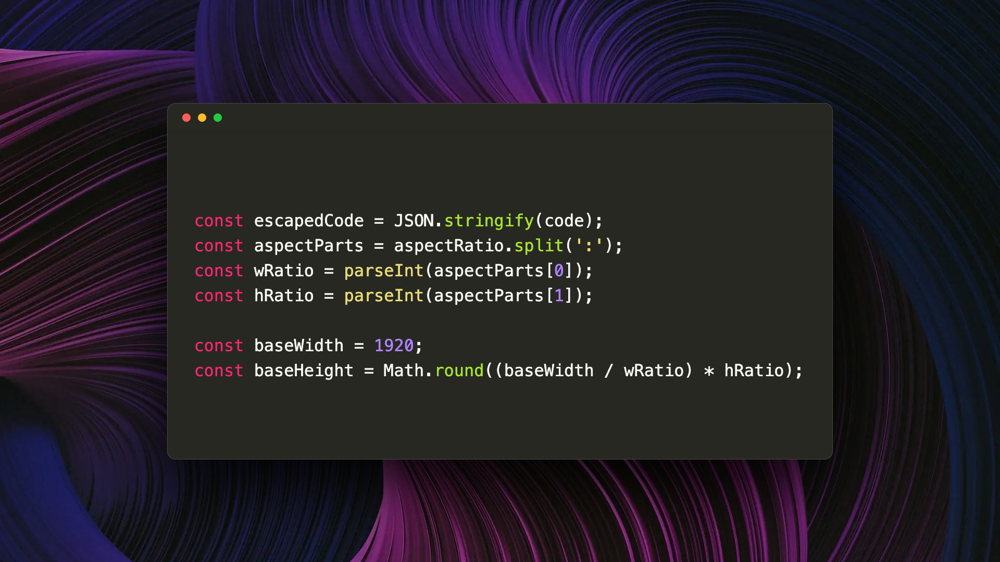

# SnapCode 📸

Capture beautiful, high-resolution screenshots of your code instantly. Wrap your code in a sleek macOS, Windows, or Linux window frame, perfectly tailored for sharing on social media, blogs, or documentation.

## ⚙️ Customization & Settings

Customize your screenshots easily in VS Code Settings (`Ctrl+,` or `Cmd+,`) by searching for **SnapCode**:

* `snapCode.theme`: Syntax highlighting theme (`monokai`, `dracula`, `nord`, `github-dark`, etc.).
* `snapCode.windowStyle`: The style of the window frame (`macos`, `windows`, `linux`, `none`).
* `snapCode.background`: Pick a background (`bg-1` to `bg-5`).
* `snapCode.aspectRatio`: Output aspect ratio (`16:9`, `4:3`, `1:1`, `21:9`, `9:16`).
* `snapCode.fontSize`: Font size of the code (default: `14`).
* `snapCode.outputFormat`: The file format of the image (`jpg` or `png`).

## ✨ Features

- **One-Click Capture:** A unobtrusive "📸 Screenshot" button appears directly as a CodeLens above your cursor. Just click it to capture!
- **Supports ALL Languages:** Works seamlessly with any programming language in VS Code.
- **Dynamic Themes:** Syntax highlighting perfectly matches your choice.
- **Smart Scaling:** Never clip your code again! The window automatically expands to fit your longest lines, perfectly centered against the background.
- **OS Window Styles:** Choose the terminal frame that matches your vibe:
  - 🍏 **macOS:** Classic traffic light dots.
  - 🪟 **Windows:** Classic Command Prompt/Terminal style.
  - 🐧 **Linux:** Ubuntu-inspired sleek headers.
  - ⬛ **None:** Minimalist mode with no frame.
- **Auto-Open & Save:** Generated images are saved to a `screenshots` folder in your workspace root and immediately opened in VS Code for you to view.

## 🚀 Usage

1. Open any file (`.ts`, `.js`, `.py`, `.go`, `.rs`, `.css`... it works on all of them!).
2. Select a block of code, or just let your cursor rest.
3. Click the **📸 Screenshot** text that appears right above your code block.
4. The high-res image is instantly saved to your workspace and opened in your editor.

## 📥 Installation

1. Open VS Code.
2. Press `Ctrl+P`, type `ext install snapcode`.
3. (Or) Build from source and copy to your `.vscode/extensions` folder.

## 📄 License

MIT License
